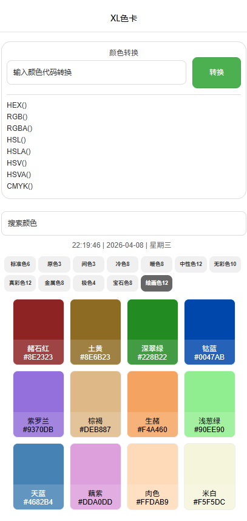

# XL色卡
一款专业的微信小程序色卡工具，支持颜色格式互转、多体系色卡查询与一键复制，高效辅助设计与开发配色。

## ✨ 功能特性
- 🎨 全格式转换：支持 HEX/RGB/RGBA/HSL/HSLA/HSV/HSVA/CMYK 一键互转
- 🎯 多体系色卡：内置标准色6、原色3、间色3、冷色8、暖色8、中性色12、无彩色10、真彩色12、金属色8、极色4、宝石色8、绘画色12 等专业色系
- 🔍 搜索配色：支持按颜色名称/代码快速检索，精准定位目标色
- 📋 一键复制：色卡卡片点击即可复制 HEX 色值，高效粘贴使用
- ⏰ 实时时钟：显示当前时间与日期，便于记录配色时间

## 📸 项目预览

## 🚀 使用说明
1. 克隆项目到本地
2. 使用微信开发者工具打开项目
3. 编译运行即可在模拟器/真机预览使用

## 📄 开源协议
MIT License
